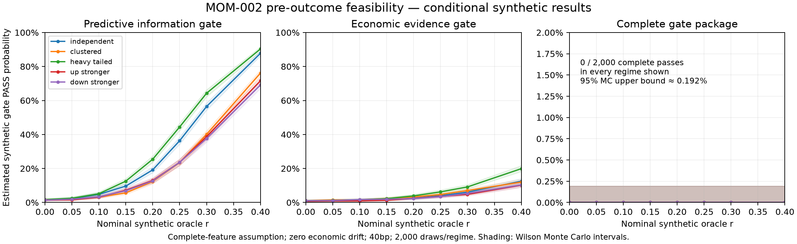

# MOM-002 synthetic power surface — pre-outcome audit

**Conclusion: INDETERMINATE_ASSUMPTIONS_REQUIRED.** MOM-002 is Draft / NEEDS_PRE_RESULT_GATE_REVIEW, unscored/unadmitted. Trial Budget 0 / Trials Consumed 0 for this methodology audit. Independent technical acceptance and human pre-result decisions remain pending.

This conditional audit evaluates the existing proposal without changing gates. It accesses no real MOM-002 outcomes, associations, forecasts or gate results. Geometry is reproduced only through causal generator primitives from existing frozen ZIPs. See [scope and reproduction](POWER_AUDIT.md).

## Design and reproducibility

2,000 Monte Carlo draws per regime, five noise/asymmetry scenarios, eight nominal oracle strengths and two exogenous missingness assumptions: 80 synthetic experiment regimes. Three synthetic economic drifts reuse each regime, giving 240 surface rows. Each experiment uses 2,000 paired percentile component-bootstrap draws under both 7d and 14d definitions. Seeds: Monte Carlo 20261005 + scenario index × 1,000,000 + draw index; bootstrap 20261002. Common random numbers couple regimes; do not pool them as independent trials.

Fixed annual 2023/2024/2025 causal ridge fits, mean-loss alpha=1, separate direction intercepts, training-only standardization/component weights, B0/B1/Tier-A matched comparisons, causal training terciles/75th-percentile alert thresholds and chronological caps reproduce the proposed gate semantics on synthetic values. Nominal r is oracle strength; finite-sample fitted OOS r is smaller and is reported separately.

Synthetic features have a common Gaussian factor; equal coefficient packet in Tier A and Tier B is specified independently of real results. Cluster noise has 14d intraclass share 0.5. Heavy-tailed noise is unit-variance Student-t(3). UP-stronger/DOWN-stronger cases use normalized 1.5/.5 signal multipliers and .8/1.2 noise scales. Missingness is exogenous 0% or 10%; common coverage begins 2020-09-01 as a documented assumption, not acceptance of exact six-feature completeness. Economic drift is 0/.10/.25 S, independently of r. Adversity uses unit-S synthetic Brownian bridges conditional on synthetic endpoints; no real excursion distribution is inferred.

## Structural constraints

The outcome-free replay reproduces 354 candidates, 107 globally spaced identities, 128 primary 7d components and 47 sensitivity 14d components. Canonical decision intervals start at cutoff+5m. Source/horizon support uses timestamps only.

| Fold | Training candidates | Spaced training | OOS candidates | Spaced OOS | 14d OOS components | Trailing-12m spaced training | Annual cap |
| --- | ---: | ---: | ---: | ---: | ---: | ---: | ---: |
| 2023 | 91 | 29 | 52 | 18 | 8 | 16 | 4 |
| 2024 | 143 | 46 | 74 | 19 | 7 | 17 | 4 |
| 2025 | 216 | 65 | 70 | 21 | 6 | 18 | 4 |

These figures assume feature completeness after documented common coverage. The causal caps are **4 + 4 + 4 = at most 12 OOS alerts**; missingness can reduce them. The package requires >=8 alerts, >=2 per fold and >=2 per direction before economic inference. Requiring the five largest positive 14d-component contributions to sum to <=60% mathematically requires **at least nine positive-contributing components** (5/K <= .60). With <=12 alerts, repeated components and negative/zero net returns sharply constrain this gate.

## Representative surface

Independent Gaussian noise, assumed complete features, zero synthetic drift. All entries are estimated pass probabilities in percent. The full JSON/CSV includes every gate, all five scenarios, both missingness assumptions and all three economic drifts.

| Nominal synthetic r | Information | Incremental | Fold consistency | Economics | Robustness | Concentration | Full PASS |
| --- | ---: | ---: | ---: | ---: | ---: | ---: | ---: |
| 0.00 | 1.40% | 0.05% | 1.65% | 0.80% | 1.05% | 0.00% | 0.00% |
| 0.05 | 2.30% | 0.05% | 2.65% | 1.25% | 1.35% | 0.00% | 0.00% |
| 0.10 | 4.75% | 0.05% | 4.80% | 1.40% | 2.80% | 0.00% | 0.00% |
| 0.15 | 9.65% | 0.45% | 8.75% | 1.60% | 5.00% | 0.00% | 0.00% |
| 0.20 | 19.20% | 1.85% | 15.05% | 2.50% | 8.30% | 0.00% | 0.00% |
| 0.25 | 36.35% | 5.20% | 25.00% | 4.00% | 15.75% | 0.00% | 0.00% |
| 0.30 | 56.50% | 11.20% | 36.30% | 6.10% | 23.50% | 0.00% | 0.00% |
| 0.40 | 87.80% | 36.40% | 61.10% | 12.55% | 46.35% | 0.00% | 0.00% |

There were **zero full passes in every tested regime**, including r=.40. The per-regime Wilson 95% upper bound for 0/2,000 is approximately **0.192%**. This is Monte Carlo uncertainty under the specified synthetic DGP, not a bound on real MOM-002 power or a predictive FAIL. All marginal gate probabilities include separate Wilson intervals in the JSON.

Concentration is the smallest marginal pass probability in most regimes; incremental information is binding in the remainder. Even where primary information is detected, the full package can almost never pass under these assumptions. The audit does not choose which severity is scientifically/economically appropriate.

At r=0, across specified regimes, primary-information false positives reach 1.70%, incremental-information 0.10%, economic-evidence 4.70%, and complete PASS 0%. Positive economic drift at r=0 is an intentionally non-predictive economic scenario, so its economic PASS probability is not a test of a zero-return null. Economic capability, predictive capability and complete-gate capability must remain distinct.

## Alert and concentration diagnostics

At nominal r=.40, independent noise, complete-feature assumption and zero drift:

| Constraint | Estimated pass probability |
| --- | ---: |
| At least eight alerts | 96.00% |
| At least two per fold | 87.35% |
| At least two per direction | 79.15% |
| All alert-count minimums together | 70.35% |
| Largest year at most 50% of positive contributions | 38.75% |
| Largest 14d component at most 25% | 8.75% |
| Five largest 14d components at most 60% | 0.00% |
| At least nine positive-contributing components | 3.35% |
| Leave-one-year-out information/increment/economics | 54.55% |
| Remove five influential components | 68.95% |

Mean alerts are 10.606, with 3.469/3.495/3.643 by fold and 6.069 UP/4.537 DOWN.
Mean positive-contributing 14d components are only 5.636, compared with the
necessary minimum of nine for the top-five concentration condition. Economic
PASS still requires the 40bp hurdle, both cluster lower bounds, positive
increment versus Tier A/B0 and every alert minimum. Full robustness combines
all leave-one-year-out checks with the five-component removal. Diagnostic
probabilities and Monte Carlo intervals for every regime are in surface.json.

Adversity uses hourly-grid synthetic bridges and omits intrahour extremes.
Its probability is a proxy conditional on the path assumption. The separately
reported full-pass probability without adversity is an upper bound under the
other synthetic assumptions; it is also zero in every tested regime. Neither
quantity establishes real MAE or unconditional real MOM-002 power.

## Required pre-result disposition

Actual feature completeness/source/PIT acceptance, a minimum worthwhile effect and terminal-versus-descriptive economics remain unresolved. The scientific conclusion is therefore **INDETERMINATE_ASSUMPTIONS_REQUIRED**, with a strong conditional feasibility warning. A human/reviewer may choose terminal economics if only a very large edge warrants continuation, or descriptive economics with terminal information/incremental evidence and increasingly prospective economic validation. The audit cannot make that choice or amend the contract.

Accept/review #58 exact artifacts, record #56 decisions, finalize/version any pre-result amendments, then provide #54 only the final packet. #51 foundation/Tier-B/overlap must also be accepted. After final independent approval and official freeze, no gate changes; real MOM-002 FAIL rejects the entire downstream branch and #59, with no MOM-003.

## Artifacts

- [Strict causal structural manifest](../../research/governance/power/population.geometry.json)
- [Every regime/gate and Monte Carlo intervals](../../research/governance/power/surface.json)
- [Compact power surface CSV](../../research/governance/power/surface.csv)
- [Recorded runtime](../../research/governance/power/environment.json)
- [Standalone scientific figure](../../research/governance/power/power_surface.svg)
- [Synthetic-only runner](../../scripts/research/power_audit.py)
- [Synthetic model/gate implementation](../../rocket/research/power.py)

Input/code SHA-256 identities and NumPy runtime version are in surface.json; exact Python/dependency versions are in environment.json. Reproduce with `python -m pip install -e ".[dev]"`, then `OPENBLAS_NUM_THREADS=1 VECLIB_MAXIMUM_THREADS=1 python scripts/research/power_audit.py`. Geometry export is separate and needs the exact pinned Git commit and already-existing source ZIPs/receipts; the simulation needs only its committed strict manifest. Tests load exclusively synthetic geometry; the official invocation journal remains empty.

Monte Carlo uncertainty uses the Wilson binomial interval. Bootstrap sampling uses NumPy’s [multinomial generator](https://numpy.org/doc/stable/reference/random/generated/numpy.random.Generator.multinomial.html); the proposed component resampling/undefined-draw semantics remain the authority. This audit is not an executable-return claim.
